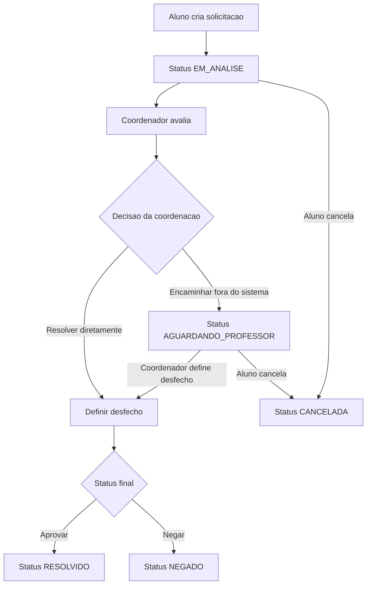

# Fluxo do Sistema

```mermaid
graph TD
    A[Aluno cria solicitacao] --> B[Status EM_ANALISE]
    B --> C[Coordenador avalia]
    C --> D{Decisao da coordenacao}

    D -->|Resolver diretamente| E[Definir desfecho]
    D -->|Encaminhar fora do sistema| F[Status AGUARDANDO_PROFESSOR]
    F -->|Coordenador define desfecho| E

    E --> H{Status final}
    H -->|Aprovar| I[Status RESOLVIDO]
    H -->|Negar| J[Status NEGADO]

    B -->|Aluno cancela| X[Status CANCELADA]
    F -->|Aluno cancela| X
```